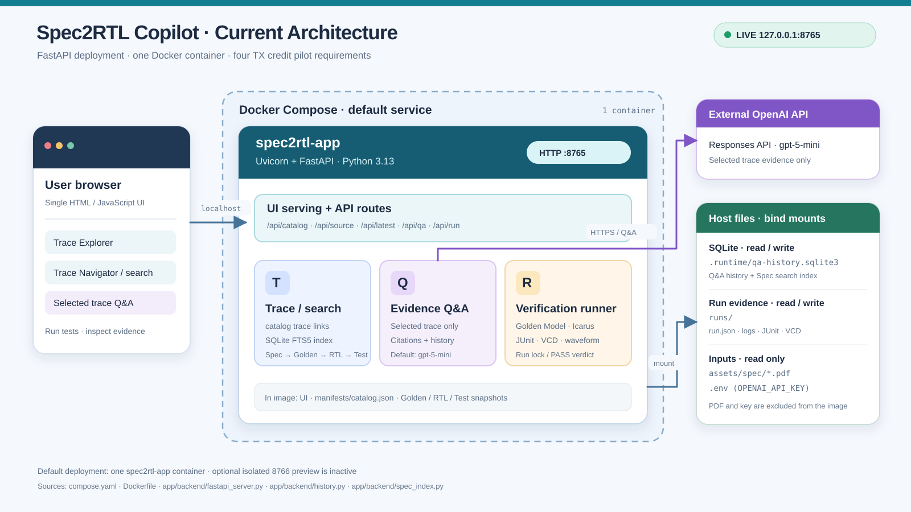
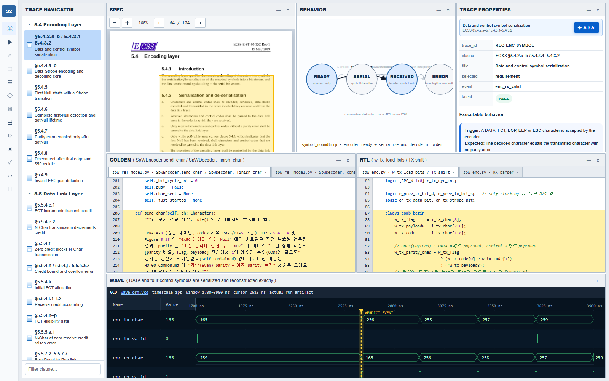
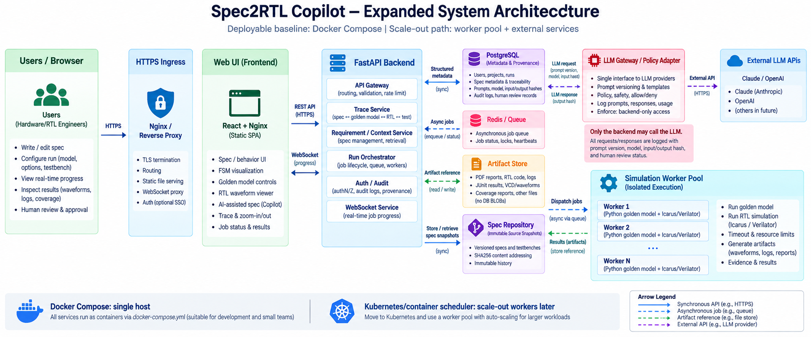
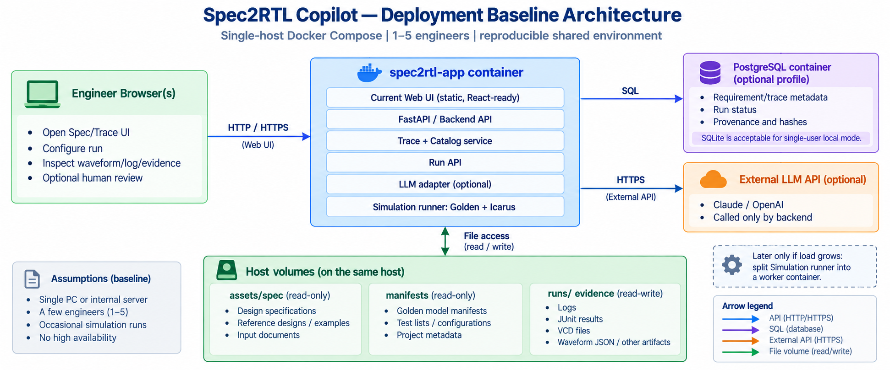

# Spec2RTL Copilot MVP

## Project reports

- [고급 PJT 업무일지 (PDF)](docs/고급PJT_업무일지.pdf)
- [Spec2RTL Copilot 프로젝트 진행 및 성과 보고서 (PDF)](docs/Spec2RTL_Copilot_Project_Report_20260930.pdf)

This directory is the standalone MVP workspace for proving a bounded executable
trace set from ECSS requirements to Golden Model, RTL, tests, and verification
evidence.

## Scope

- Current executable subset: 18 Requirement cards from ECSS-E-ST-50-12C Rev.1
  (seven Encoding Layer 5.4 cards and eleven Data Link Layer 5.5 cards).
- Original pilot and core demo path: clause 5.5.4.e/f/h/j TX credit.
- This is not a claim of complete 5.4 or 5.5 compliance. Controlled Data/Strobe
  reset, imported-top integration, PortReset FIFO semantics, and unresolved
  transmit-priority policy remain outside the approved executable subset.
- Implementation baseline: `spec2rtl/spacewire`
- Imported assets under `assets/` are immutable snapshots.
- The ECSS PDF is user-supplied and intentionally excluded from Git for public
  distribution. See `assets/spec/README.md` for the expected local filename.
- All new metadata and future application code live in this directory.

## W0-W3 layout

- `assets/`: approved source snapshots; do not edit
- `manifests/source-baseline.yaml`: origin, revision, tools, commands
- `manifests/SHA256SUMS`: integrity evidence for every imported file
- `requirements/flow-control.yaml`: pilot atomic requirements
- `trace/flow-control.yaml`: Spec -> Golden -> RTL -> Test mapping
- `runs/baseline/`: baseline regression evidence
- `app/ui/`: copied UI mock; functional edits start after W0-W3

## W4-W9 live MVP

- `scripts/run_mvp.py`: allowlisted Golden + RTL runner and evidence writer
- `app/backend/fastapi_server.py`: Docker API, source containment, run lock, UI server
- `app/backend/server.py`: shared MVP helpers and legacy local server
- `manifests/catalog.json`: UI view model for Requirement-to-source trace
- `runs/<run-id>/`: immutable result, log, JUnit, VCD, and waveform JSON
- Diagram, Architecture/uArch editing, AI design, and root-cause analysis remain
  explicitly marked static previews.
- Requirement provenance includes the ECSS clause, physical PDF page, printed
  page, and a short normative excerpt. The current pilot maps clauses
  5.5.4.e.1/e.2/f to page 74 and 5.5.4.h/j plus 5.5.5.a.2 to page 75.
- MVP Live opens focused Golden/RTL/Test source with highlighted line ranges,
  separates Golden/compile/simulation logs into tabs, and renders a
  requirement-specific waveform window with a verdict-event marker.
- Basic P2 navigation is included: direct PDF-page opening, eighteen-requirement
  switching, and JUnit/VCD artifact access. The Trace Navigator is the executable
  subset, not the complete ECSS table of contents. It groups cards in ECSS order
  (5.4 Encoding, then 5.5 Data Link), sorts by representative clause, and selects
  `REQ-ENC-SYMBOL` (5.4.2) on a normal first visit. Cross-pilot search remains deferred.
- Trace Properties offers a prominent `Ask AI` action for evidence-scoped Q&A on
  the selected Requirement.
  Answers cite the selected Spec, Golden, RTL, Test, and latest run sources;
  verification verdicts still come from the executable tests.
- Q&A history is stored locally in SQLite and shown by selected Requirement.
- The eighteen approved Spec cards and their Golden/RTL/Test links are indexed in
  SQLite for search; `manifests/catalog.json` remains the authoritative view model.

Start the legacy local server directly and open `http://127.0.0.1:8765`:

```bash
cd spec2rtl_copilot
python3 app/backend/server.py
```

`127.0.0.1` is loopback-only: it is available to a browser on the same machine,
but not directly to a remote ChatGPT environment or an external reviewer.

### Temporary external demo with ngrok

Use an authenticated tunnel for a short external review. Keep the real policy
outside the repository because it contains a credential:

```bash
cp ngrok-policy.example.yml /tmp/spec2rtl-ngrok-policy.yml
nano /tmp/spec2rtl-ngrok-policy.yml
ngrok http 127.0.0.1:8765 \
  --traffic-policy-file /tmp/spec2rtl-ngrok-policy.yml
```

Replace the placeholder with a long temporary password, then send the assigned
HTTPS URL and the Basic Auth credential to the intended reviewer. Stop ngrok
with `Ctrl+C` after the demo. Do not expose this application without access
control: authenticated users can read the local specification, source excerpts,
Q&A history and run artifacts, invoke `/api/run`, and consume the configured
OpenAI API through `/api/qa`. The root `ngrok-policy.yml` name is ignored by Git
as an additional guard, but `/tmp` is the recommended location.

The embedded, highlighted PDF page view is enabled when the user has placed the
specification at the documented local path and Poppler's `pdftoppm` is
available. Trace metadata and page references remain available without
redistributing the document.

For Q&A, set `OPENAI_API_KEY` in the local `.env` file or process environment
before starting the server. `SPEC2RTL_QA_MODEL` optionally overrides the
default `gpt-5-mini` model. The `.env` file is ignored by Git. The server sends
only the selected requirement's bounded trace excerpts to the OpenAI Responses
API; Test and latest run evidence are included only for verification questions.
It does not upload the full PDF or VCD.

Successful Q&A responses are saved to `app/backend/.runtime/qa-history.sqlite3`
with the question, answer, cited sources, model, timestamp, and linked run ID.
The Q&A dialog shows the five newest questions for its Requirement; opening a
saved answer does not call the LLM again. Set `SPEC2RTL_DB_PATH` to use another
SQLite file. The database is ignored by Git and is independent of the trace
manifest and immutable run evidence. Saved JUnit links retain their run ID.

Spec search uses the same local SQLite file. The backend projects clause IDs,
document revision, page numbers, normative excerpts, and trace links from
`manifests/catalog.json` into indexed tables and refreshes them when the catalog
changes. Full-text search uses SQLite FTS5; a clause-number query uses literal
substring matching. The ECSS PDF remains a read-only file outside the image.
For example:

```bash
curl -fsS 'http://127.0.0.1:8765/api/spec/search?q=zero%20credit'
curl -fsS 'http://127.0.0.1:8765/api/spec/search?q=5.5.4.e.1'
```

The pilot Q&A acceptance questions and review results are in
`tests/qa_acceptance_cases.json` and `docs/QA_ACCEPTANCE_REPORT.md`.
The current [project handoff](docs/PROJECT_HANDOFF.md) and
[five-minute demo script](docs/DEMO_SCRIPT.md) summarize the deployed scope.
The [presentation report PDF](docs/Spec2RTL_Copilot_Demo_Report.pdf) packages
the implementation, verification results, demo flow, and expected Q&A.
The [RTL-based 12-item coverage matrix](docs/RTL_COVERAGE_MATRIX.md) separates
implemented, tested, and MVP-integrated scope for the next expansion.
The [Encoding Layer coverage matrix](docs/ENCODING_COVERAGE_MATRIX.md) records
the seven integrated ECSS 5.4 executable cards and the remaining full-compliance
gaps at the enable/reset and imported-top boundaries.

The current checked-in evidence run `20260928T233433+0900-3998fb00` is 22/22
PASS. The host acceptance suite runs 53 tests; five FastAPI-only contracts are
skipped when FastAPI is not installed locally and are covered by the isolated
image command below.

Run the complete acceptance suite:

```bash
python3 -m unittest discover -s tests -v
```

FastAPI route contracts also run inside the application image, without network
access or writes to the live SQLite and `runs/` volumes. The OpenAI call and
verification runner are mocked; the tests use a temporary SQLite file. The
general host suite skips these five tests if FastAPI is not installed locally:

```bash
docker build -t spec2rtl-copilot:test .
docker run --rm --network none --read-only --tmpfs /tmp:rw,nosuid,nodev,size=64m \
  spec2rtl-copilot:test \
  python3 -m unittest discover -s tests -p 'test_fastapi_contract.py' -v
```

## Docker Compose

The default single-container deployment runs the same local UI, FastAPI,
Golden Model, and Icarus RTL runner. Docker Compose is required on the host.
On WSL, enable Docker Desktop's WSL integration so `docker compose` is available
in the distro.
For a fresh checkout, create the local `.env` file from `.env.example` and set
`OPENAI_API_KEY` only when Q&A is needed. An existing `.env` is preserved:

```bash
test -f .env || cp .env.example .env
docker compose up --build -d
docker compose ps
curl -fsS http://127.0.0.1:8765/api/health
```

Open `http://127.0.0.1:8765`. The port is bound to the host loopback address.
Compose mounts `.env` read-only, so the API key is available to the backend
without being copied into the image. It mounts `runs/` and
`app/backend/.runtime/` read-write, preserving verification evidence and SQLite
Q&A history across container recreation. The local ECSS PDF is mounted from
`assets/spec/` read-only; it is excluded from the image. The container runs as
UID/GID 1000 by default. If your files have another owner, start with
`LOCAL_UID=$(id -u) LOCAL_GID=$(id -g) docker compose up --build -d`.
The checkout includes an empty `.runtime/` directory so the container can
create its SQLite database with the host user's permissions on first start.
Stop with `docker compose down`; the bind-mounted files remain on the host.



### Optional isolated preview

The default FastAPI server uses port 8765 and the existing `runs/` and SQLite
data. An optional second FastAPI server serves the same UI and API on port 8766,
with isolated `runs/`, SQLite, and PDF cache under
`app/backend/.runtime/fastapi-preview*`. It reuses the local `.env` read-only.
Start only the preview service without recreating the 8765 container:

```bash
mkdir -p app/backend/.runtime/fastapi-preview app/backend/.runtime/fastapi-preview-runs
docker compose --profile fastapi build spec2rtl-fastapi
docker compose --profile fastapi up -d --no-deps spec2rtl-fastapi
curl -fsS http://127.0.0.1:8766/api/health
```

Open `http://127.0.0.1:8766` for the preview UI, or `/docs` for its OpenAPI
interface. The preview initially has no latest run; click Run MVP once to
create its own evidence. Its Q&A history is separate from port 8765. Stop only
the preview with `docker compose --profile fastapi stop spec2rtl-fastapi`.

## Baseline verification

```bash
cd spec2rtl_copilot
sha256sum --check manifests/SHA256SUMS
cd assets/golden && python3 spw_ref_model_test_v5.py
```

RTL regression uses Icarus Verilog 12.0 with `-g2005-sv`; `-g2012` is
intentionally excluded because of the documented Icarus multi-instance issue.

## Current Trace Explorer screenshot

The current screenshot shows the ECSS-ordered executable subset and the
Requirement-scoped `Ask AI` action.



## Expanded deployment architecture

The scale-out target separates the React/Nginx frontend, FastAPI backend,
PostgreSQL metadata store, asynchronous simulation-worker pool, artifact store,
and backend-only LLM gateway. Docker Compose is the single-host deployment
baseline; a container scheduler can scale workers later.



## Deployment baseline

The default Compose baseline uses one FastAPI `spec2rtl-app` container, local SQLite
for Q&A history, and the external OpenAI API. Golden/RTL execution and
verification evidence remain on host volumes. The PostgreSQL service and
separate simulation worker in the diagram are future expansion options. The
optional FastAPI preview is a second isolated container for API comparison.


