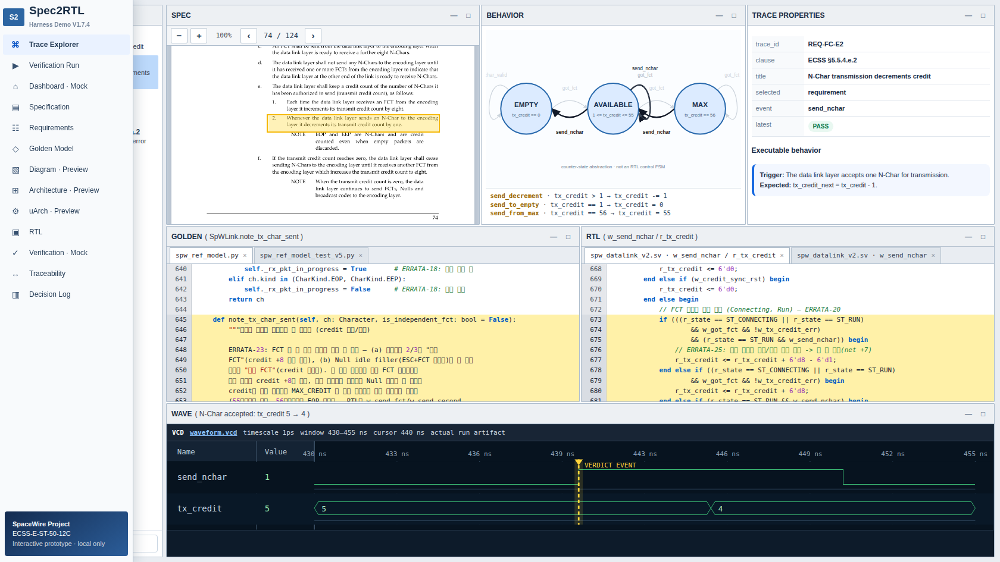

# Spec2RTL Copilot MVP

This directory is the standalone MVP workspace for proving one executable
trace from ECSS requirement to Golden Model, RTL, and verification evidence.

## Scope

- Pilot: ECSS-E-ST-50-12C Rev.1, clause 5.5.4.e/f/h/j (TX credit)
- Implementation baseline: `spec2rtl/spacewire`
- Imported assets under `assets/` are immutable snapshots.
- The ECSS PDF is user-supplied and intentionally excluded from Git for public
  distribution. See `assets/spec/README.md` for the expected local filename.
- All new metadata and future application code live in this directory.

## W0-W3 layout

- `assets/`: approved source snapshots; do not edit
- `manifests/source-baseline.yaml`: origin, revision, tools, commands
- `manifests/SHA256SUMS`: integrity evidence for every imported file
- `requirements/flow-control.yaml`: pilot atomic requirements
- `trace/flow-control.yaml`: Spec -> Golden -> RTL -> Test mapping
- `runs/baseline/`: baseline regression evidence
- `app/ui/`: copied UI mock; functional edits start after W0-W3

## W4-W9 live MVP

- `scripts/run_mvp.py`: allowlisted Golden + RTL runner and evidence writer
- `app/backend/server.py`: local API, source containment, run lock, UI server
- `manifests/catalog.json`: UI view model for Requirement-to-source trace
- `runs/<run-id>/`: immutable result, log, JUnit, VCD, and waveform JSON
- Diagram, Architecture/uArch editing, AI design, and root-cause analysis remain
  explicitly marked static previews.
- Requirement provenance includes the ECSS clause, physical PDF page, printed
  page, and a short normative excerpt. The current pilot maps clauses
  5.5.4.e.1/e.2/f to page 74 and 5.5.4.h/j plus 5.5.5.a.2 to page 75.
- MVP Live opens focused Golden/RTL/Test source with highlighted line ranges,
  separates Golden/compile/simulation logs into tabs, and renders a
  requirement-specific waveform window with a verdict-event marker.
- Basic P2 navigation is included: direct PDF-page opening, four-requirement
  switching, and JUnit/VCD artifact access. Cross-pilot search remains deferred.

Start the local MVP and open `http://127.0.0.1:8765`:

```bash
cd spec2rtl_copilot
python3 app/backend/server.py
```

The embedded, highlighted PDF page view is enabled when the user has placed the
specification at the documented local path and Poppler's `pdftoppm` is
available. Trace metadata and page references remain available without
redistributing the document.

Run the complete acceptance suite:

```bash
python3 -m unittest discover -s tests -v
```

## Baseline verification

```bash
cd spec2rtl_copilot
sha256sum --check manifests/SHA256SUMS
cd assets/golden && python3 spw_ref_model_test_v5.py
```

RTL regression uses Icarus Verilog 12.0 with `-g2005-sv`; `-g2012` is
intentionally excluded because of the documented Icarus multi-instance issue.

## Current UI


